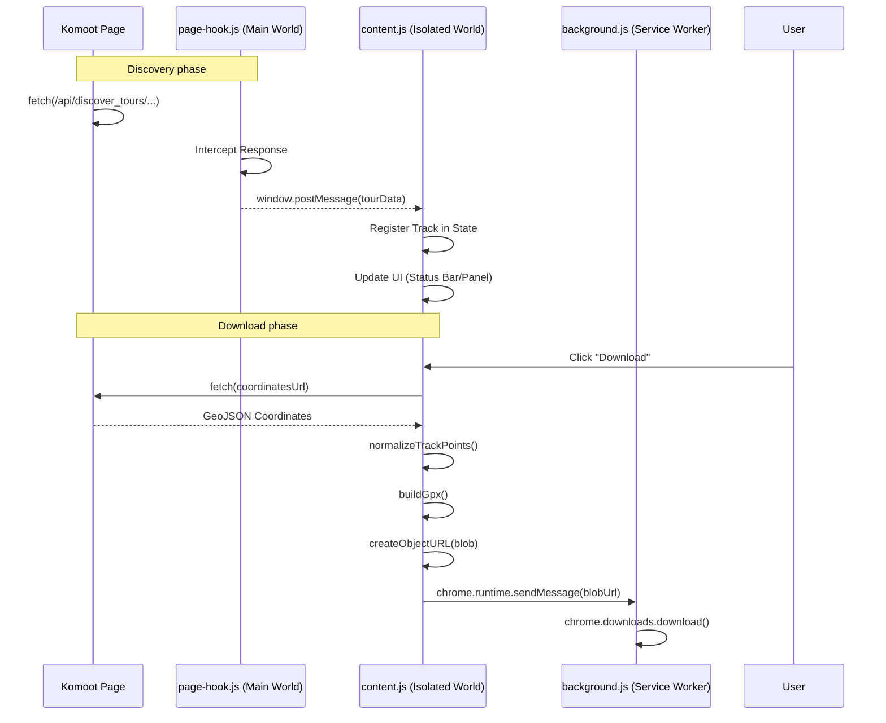

# Komoot GPX Exporter - Technical Documentation

## Overview

The Komoot GPX Exporter is a cross-browser extension (Chrome and Firefox) designed to capture tour data from the Komoot website and export it as high-quality GPX files. It supports both static page scraping and dynamic tour discovery through network interception.

## 🏗 Architecture & Design Decisions

### 1. Context Separation & Interception

Modern web applications like Komoot execute their logic in the **Main World** (the page's execution context). Browser extensions, however, run content scripts in an **Isolated World**.

- **Decision**: To intercept network requests made by Komoot (fetch/XHR), we use a dual-interceptor approach.
- **Implementation**:
  - `page-hook.js`: Injected into the Main World to monkey-patch `window.fetch` and `window.XMLHttpRequest`. It intercepts responses from Komoot's discovery APIs.
  - `content.js`: Acts as the orchestrator. It receives data from `page-hook.js` via a secure `window.postMessage` bridge.

### 2. UI Isolation (Shadow DOM)

- **Decision**: The extension's UI is injected into the host page but encapsulated within a **Shadow DOM**.
- **Rationale**: This prevents "style leakage." Komoot's global CSS cannot affect the extension's UI, and the extension's CSS cannot break the layout of the Komoot website. It also ensures that the extension remains functional even if Komoot updates its theme or adds breaking CSS changes.

### 3. Asynchronous Download Flow

- **Decision**: All downloads are handled via the `chrome.downloads` API in the background script.
- **Rationale**:
  - **Persistence**: Downloads managed by the browser's download manager are more stable.
  - **Large File Support**: We use `Blob` and `URL.createObjectURL` to handle large GPX files that would exceed `data:` URI character limits.

---

## 🔁 Process Flow: Track Discovery & Export



---

## 🛠 Component Breakdown

### `page-hook.js` (The Spy)

- **Role**: Main context network interceptor.
- **Key Logic**: Patches `fetch` and `XHR`. Only filters for URLs matching the `API_VERSION` (currently `v007`) and `discover_tours` pattern.
- **Security**: Uses `window.postMessage(data, window.location.origin)` to ensure data is only sent back to the extension on the same origin.

### `content.js` (The Orchestrator)

- **UI Logic**: Manages the export button, status indicators, and the "Saved Tracks" side panel.
- **GPX Logic**:
  - `normalizeTrackPoints`: Converts Komoot's internal coordinate format (including altitude and timestamps) into standard GPS data.
  - `buildGpx`: Generates a valid GPX 1.1 XML document with metadata links back to the source tour.
- **Discovery Logic**: Scans `document.scripts` on initial load to find any pre-loaded tour data that might have preceded the network hook injection.

### `background.js` (The Dispatcher)

- **Role**: Simple service worker that acts as a bridge to privileged browser APIs.
- **Key Logic**: Listens for `komoot-gpx:download` messages and calls `chrome.downloads.download`.

### `content.css` (The Look)

- **Design**: Uses a "Dark Glassmorphism" aesthetic with HSL-tailored colors (`#c9f36b` green accent).
- **Isolation**: Styles are targeted at `:host` and internal IDs within the Shadow DOM.

---

## ⚙ API & Data Handling

### Versioning

The extension centralizes the Komoot API version in a constant `API_VERSION`. This allows for quick updates if Komoot shifts from `v007` to a newer endpoint version.

### GPX Construction Details

- **Namespace**: `http://www.topografix.com/GPX/1/1`
- **Metadata**: Includes the tour name and the `sourceUrl` (the Komoot page where the track was found).
- **Points**: Each `<trkpt>` includes `lat`, `lon`, and optionally `<ele>` (elevation) and `<time>` if present in the source data.

### Robustness Features

- **Duplicate Prevention**: Tracks are deduplicated using their unique coordinates URL.
- **Capacity**: The list is capped at `MAX_TRACKS` (40) to prevent excessive memory usage in long sessions.
- **Blob Management**: Blob URLs are automatically revoked after 10 seconds to clean up memory.

---

## 🔍 Fetch / XHR Interception: Rationale & Mechanism

### Why Interception Is Necessary

Komoot is a single-page application (SPA). When a user navigates between tours, the page does not fully reload — instead, Komoot fetches tour data via `fetch()` and `XHR` calls from its own JavaScript code running in the **main world** (the page's execution context).

A browser extension's content script runs in an **isolated world** and **cannot observe network requests** initiated by the page. The standard extension APIs (`webRequest`, `declarativeNetRequest`) can observe HTTP traffic but **cannot read response bodies** in Manifest V3. This means there is no standards-compliant extension API that allows the extension to read the JSON payload returned by Komoot's discover-tour endpoints.

The only viable approach is to **monkey-patch `window.fetch` and `XMLHttpRequest`** in the page's own execution context, intercept the specific API responses we need, and relay them to the content script.

### What Is Intercepted

The hook targets a **single, narrow pattern**: Komoot's discover-tour API endpoint:

```
/api/v007/discover_tours/{tourId}
```

All other requests pass through completely untouched. The hook:

1. Calls the **original** `fetch()` / `XHR.send()` — the request is never modified, blocked, or delayed.
2. Checks the **response URL** against the discover-tour pattern.
3. If it matches and the response is successful (HTTP 2xx), **clones** the response (for `fetch`) or reads `responseText`/`response` (for XHR) and posts the payload to the content script.
4. Returns the **original, unmodified response** to the calling page code.

### Security Measures

| Concern | Mitigation |
|---|---|
| Data leakage | `postMessage` is scoped to `window.location.origin` — only same-origin listeners receive it. |
| Message spoofing | The content script validates `event.source === window`, `payload.type`, and `payload.source` before processing. |
| Scope of patching | Only `fetch` and `XHR` are patched; no other globals are modified. |
| Response integrity | The original response is never mutated; `response.clone()` is used for `fetch`. |
| Injection method | `page-hook.js` is loaded via a `src`-based `<script>` element pointing to `chrome.runtime.getURL()`, which complies with CSP and avoids inline code. |

### Alternatives Considered

| Alternative | Why It Was Rejected |
|---|---|
| `webRequest` API (MV2) | Deprecated in Manifest V3; not available for new submissions. |
| `declarativeNetRequest` (MV3) | Can only modify/block requests — **cannot read response bodies**. |
| Polling the DOM for data | Komoot does not reliably render all tour metadata in the DOM; coordinates are never in the DOM. |
| Periodically re-fetching the API | Would require authentication tokens the extension does not have; would double network traffic. |
| `MutationObserver` on `<script>` tags | Only works for SSR-injected inline scripts (handled separately by `discoverTourEndpoints()`); does not cover SPA navigations. |
